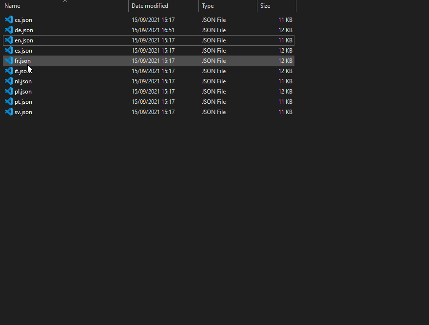

# Translating EasyAdmin

EasyAdmin Supports Translations, it has already been fully translated into multiple Languages, and thanks to Community Contributions, is being Translated to many more!

If you want to try your hand at Translating it yourself, follow this Guide, your changes might be included in EasyAdmin's next Update then!

## Forking the Repository

Before starting to Translate, first we need to fork EasyAdmin, this requires a Github account, make sure you are logged in, then simply click the "Fork" button on the EasyAdmin Github Page:

Now that you have your own Fork, you can get to editing Files!

First off, download your newly forked EasyAdmin as a ZIP File:

Now we extract our EasyAdmin to a folder of our liking and open the "language" folder:

then, we simply right click and copy the `en.json` file, this will be our template, we then rename it to our Language, in our case we will simply rename it to `en_2.json`, please make sure you follow the ISO-639-1 Standard to name your File.

Now, we simply open it with an editor of our choice and start translating it, important is that we ONLY change the areas marked in Red:

The Values to the left are names which EasyAdmin will use to find the specific translates, these should not be translated!

Once you have finished your translation, open your Fork on GitHub again, open the "language" folder and select "Upload File"

Then, simply drag&drop your new file, now we are ready to create a Pull Request!

Simply open the "Pull Requests" tab at the top of the page and select "New pull request", now we will have to select "base" as `Blumlaut/EasyAdmin` and compare as your Fork.

Once you've done that, simply click "Create pull request" and your Pull Request will be created! You dont have to do anything else, you will most likely recieve a response to it in the coming days.
